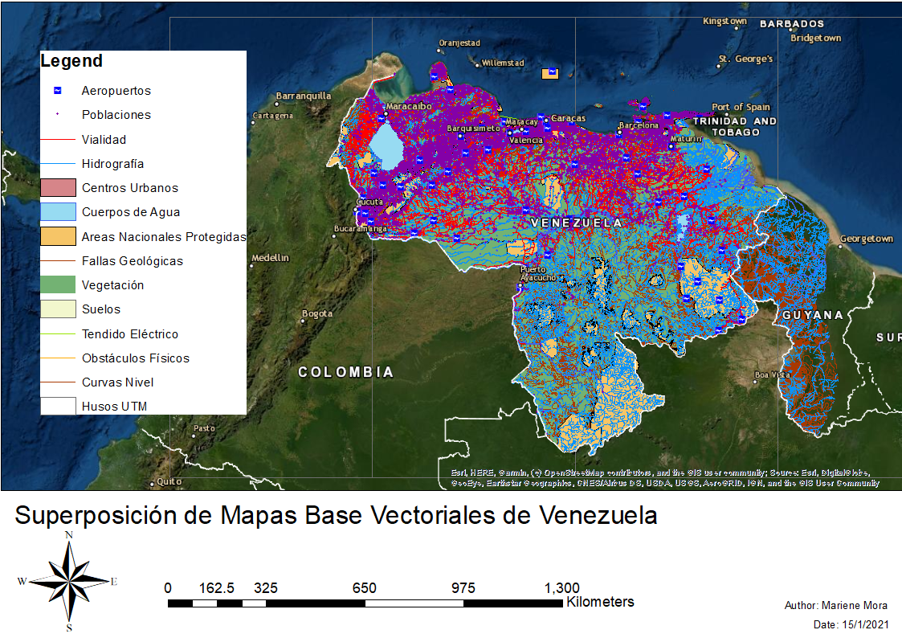

# Mariene-gis-portfolio
GIS Projects, Spatial Analysis and Mapping Portfolio by Mariene Mora

# Mariene Mora

## Geospatial Analysis (GIS) Portfolio

Electrical Engineer with experience in GIS, spatial analysis, multicriteria route selection, mapping, and geospatial data management.

### About This Project

This portfolio showcases GIS-based transmission line route selection projects developed during my Electrical Engineering studies at Universidad de Los Andes (Venezuela).

The work involved multicriteria spatial analysis, environmental assessment, engineering constraints, economic evaluation, and optimal route selection using GIS tools.

---

## Technical Skills

- ArcGIS
- QGIS
- Spatial Analysis
- Multicriteria Evaluation (MCE)
- Cost Distance Analysis
- Raster Analysis
- Vector Analysis
- Cartography
- Geospatial Data Management
- Transmission Line Planning

---

## Featured GIS Project

### Transmission Line Route Selection

Route selection study using multicriteria analysis for electrical transmission infrastructure.

#### Analysis Included

- Environmental Criteria
- Economic Criteria
- Engineering Criteria
- Cost Surface Generation
- Accumulated Cost Analysis
- Final Route Optimization

#### Project Outputs

- Environmental Maps
- Economic Maps
- Engineering Maps
- Cost Distance Maps
- Final Route Maps
- Technical Documentation

---

## Education

**Electrical Engineer**  
Universidad de Los Andes (ULA)  
Mérida, Venezuela

---

## Contact

LinkedIn:  
www.linkedin.com/in/mariene-mora-196a90191

# GIS Project Gallery

## Base Data

### Base Map

---

## Environmental Analysis

### Environmental Criteria

---

## Economic Analysis

### Economic Criteria

---

## Engineering Analysis

### Engineering Criteria

---

## Cost Surface Analysis

### Accumulated Cost

### Cost Distance

---

## Route Optimization

### Final Route Selection

---

## Project Description

This GIS project was developed as part of an Electrical Engineering thesis focused on transmission line route selection using multicriteria evaluation.

The analysis integrated:

- Environmental constraints
- Economic factors
- Engineering considerations
- Cost distance modeling
- Spatial analysis
- Route optimization

Tools Used:

- ArcGIS
- Spatial Analyst
- Raster Analysis
- Vector Analysis
- GIS Cartography

- ## Thesis Project

### GIS-Based Route Selection Using Multicriteria Analysis

This project was developed as part of my Electrical Engineering degree at Universidad de Los Andes (Venezuela).

The study focused on transmission line route selection using GIS tools and multicriteria analysis techniques, integrating environmental, economic, and engineering factors to identify optimal routes.

📄 **Full Thesis**

[View Thesis PDF](Maps/GIS_Multicriteria_Route_Selection_Thesis.pdf)
